# **Práctica 2: Despliegue de Aplicaciones con Proxy Inverso**

## **1. Configuración del Entorno**

### **Máquina: Escritorio Pr. Combinada Serv. Ap.**
Se han instalado los siguientes componentes:
- PHP
  
  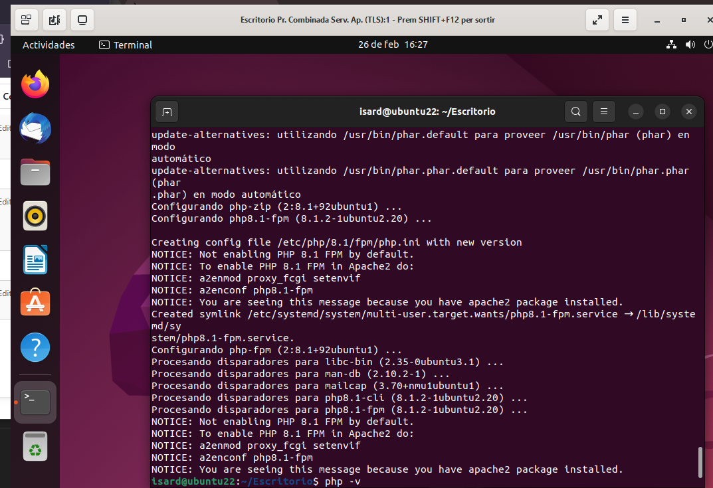
- Nginx
- Node.js
- MySQL
- **Pendiente**: Complementos de PHP
- **Opcional**: phpMyAdmin
  
  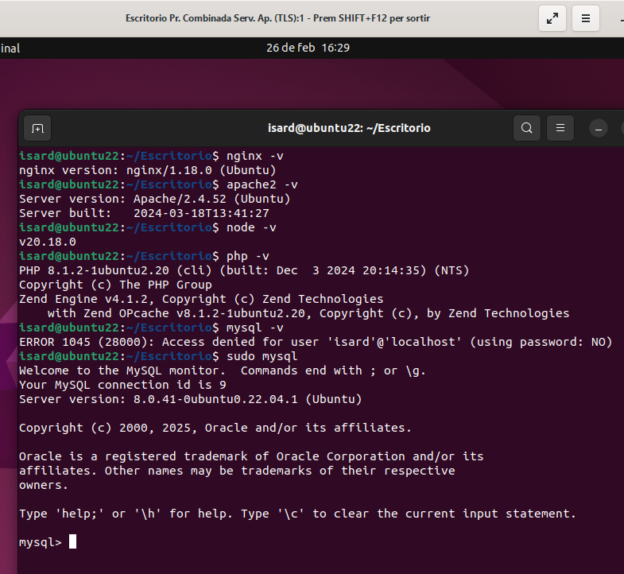

---
## **2. Despliegue 1: Aplicación PHP en Apache (Puerto 8080)**

### **Configuración**
- Apache escucha en el puerto **8080**.
- URL de acceso: [http://localhost:8080](http://localhost:8080)
- Aplicación demo de sesiones anteriores.

#### **Pasos realizados:**
1. **Configuración del puerto en Apache**
   
   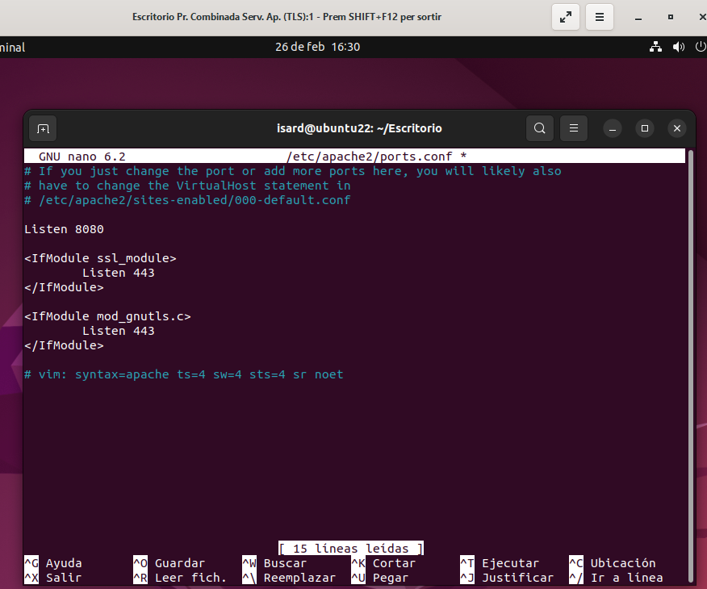

2. **Creación del VirtualHost para la app PHP**
   
   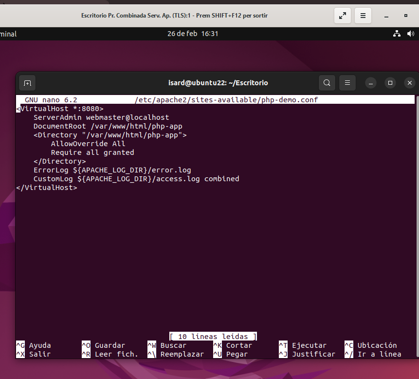

3. **Habilitación del sitio en Apache**
   
   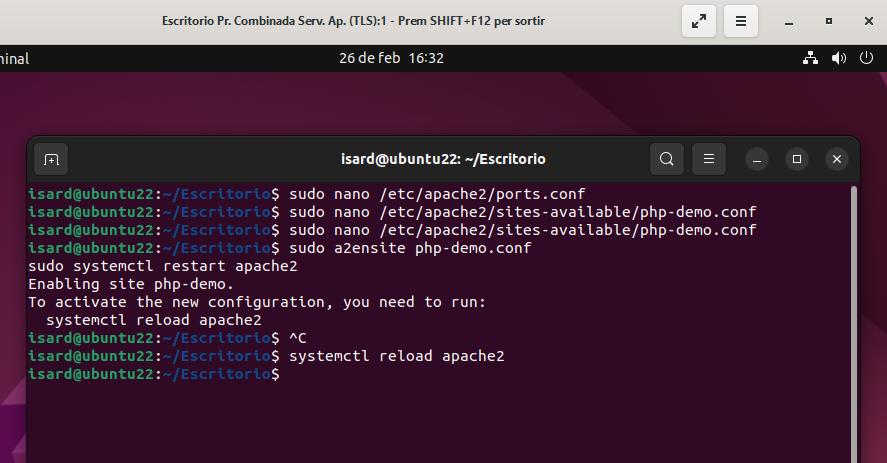

4. **Descarga de la aplicación desde GitHub**
   
   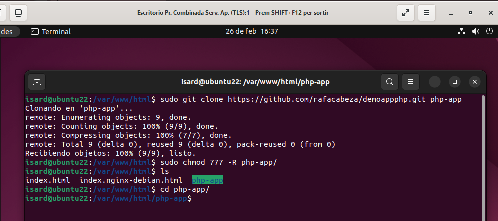

5. **Configuración de MySQL**
   
   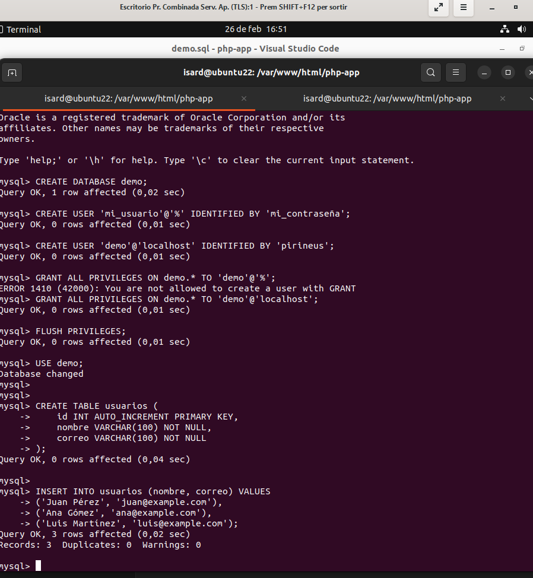

6. **Resultado final de la aplicación PHP**
   
   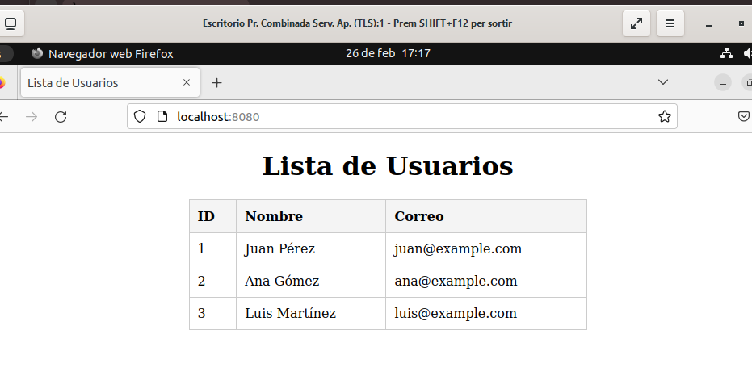

---
## **3. Despliegue 2: Aplicación Node.js (Puerto 3000)**

### **Configuración**
- Node.js ejecutando en el puerto **3000**.
- URL de acceso: [http://localhost:3000](http://localhost:3000)
- Aplicación demo de sesiones anteriores.

#### **Pasos realizados:**
1. **Importación de la base de datos** (archivo SQL sobre "deseos")
   
   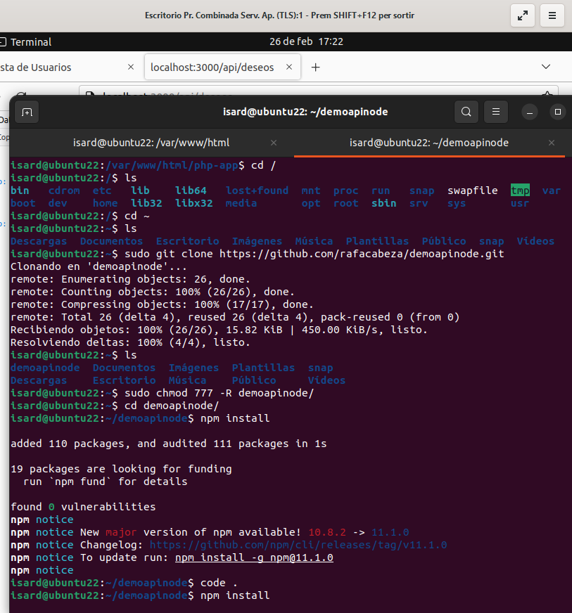

2. **Ejecución de la aplicación Node.js**
   
   ```sh
   npm run start
   ```

3. **Resultado final de la aplicación Node.js**
   
   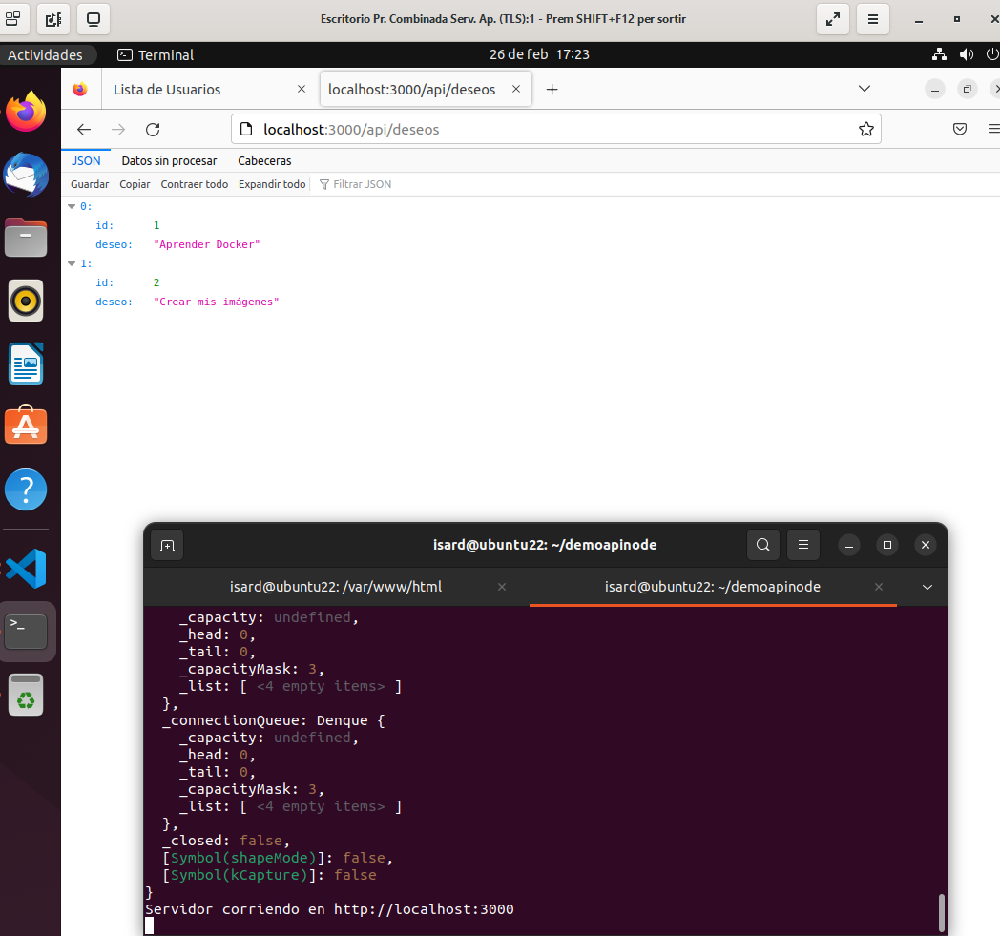

---
## **4. Configuración del Proxy Inverso con Nginx**

### **Configuración**
- **Sitio 1:** [http://php.local](http://php.local)
- **Sitio 2:** [http://node.local](http://node.local)
- **Puerto:** 80
- **Configuraciones adicionales:** Archivo `hosts` modificado.

#### **Pasos realizados:**
1. **Configuración del proxy inverso en Nginx**
   
   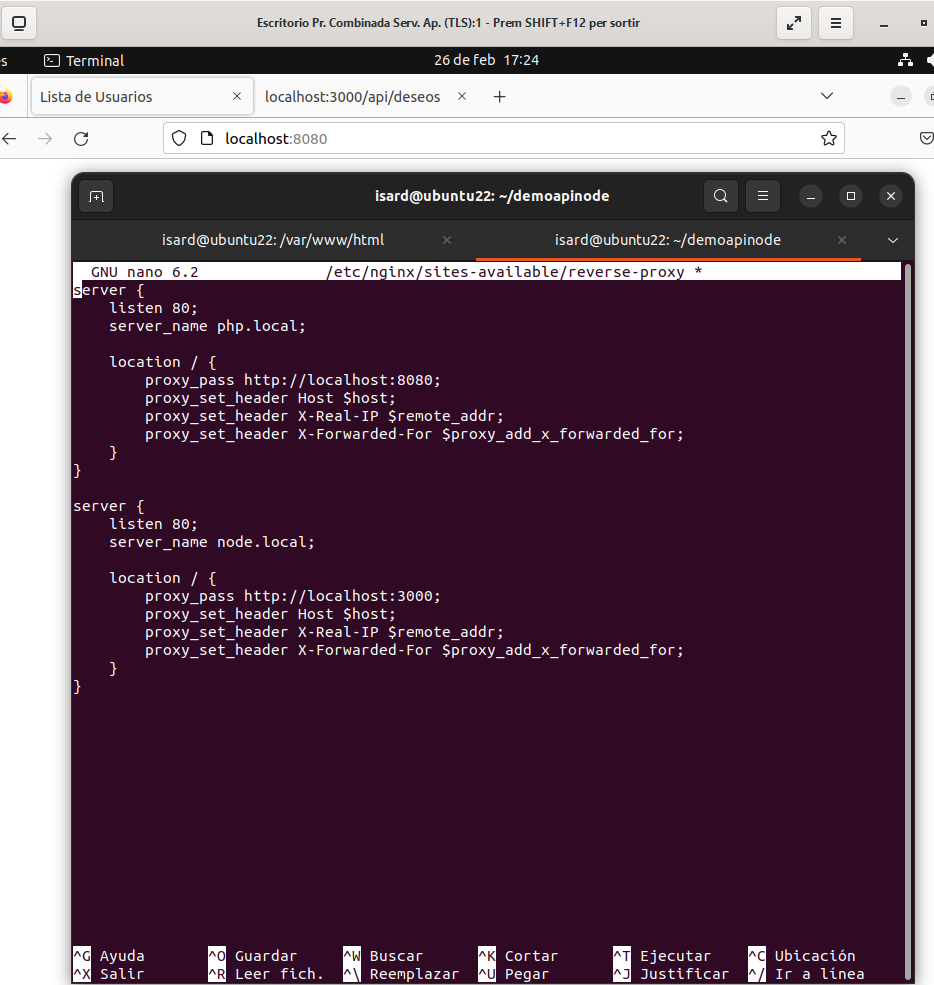

2. **Habilitación y reinicio de Nginx**
   
   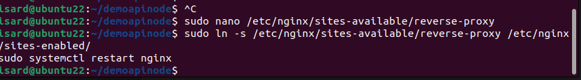

3. **Modificación del archivo hosts** y reinicio
   
   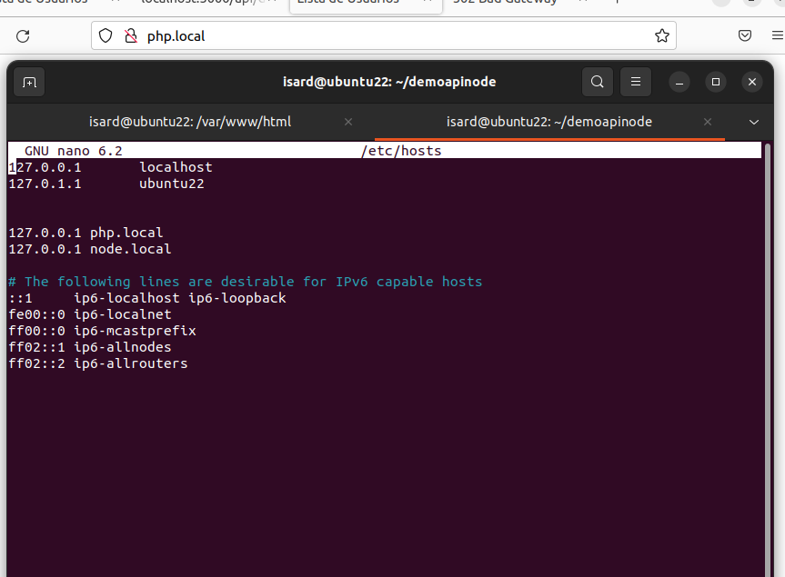

4. **Verificación de `php.local`**
   
   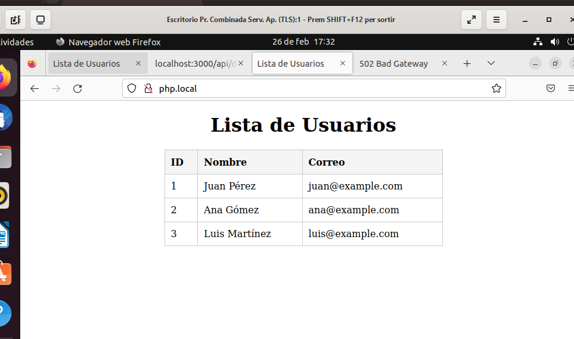

5. **Verificación de `node.local` (con la app corriendo en el puerto 3000)**
   
   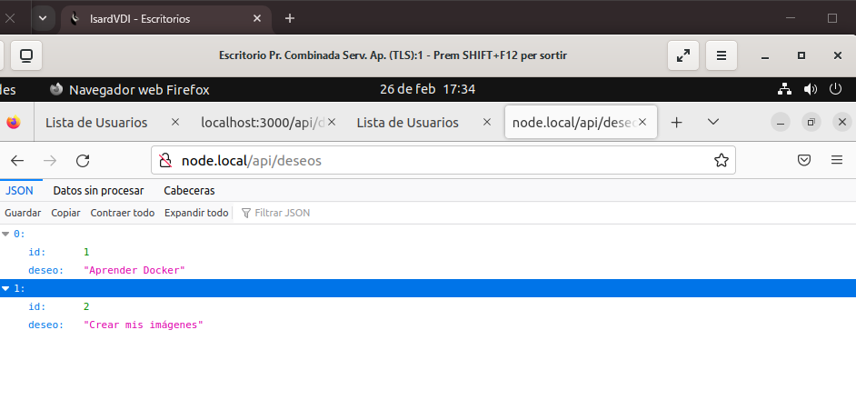

---

### ✅ **Despliegue exitoso de ambas aplicaciones con proxy inverso configurado correctamente.** 🚀