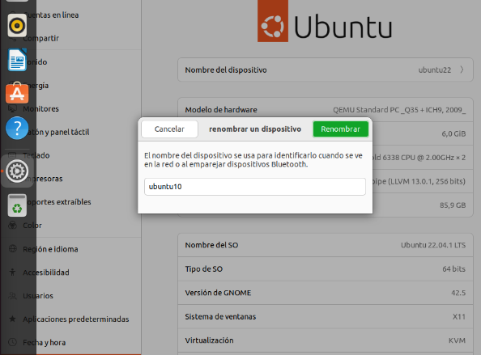
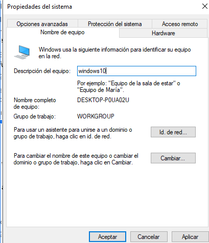
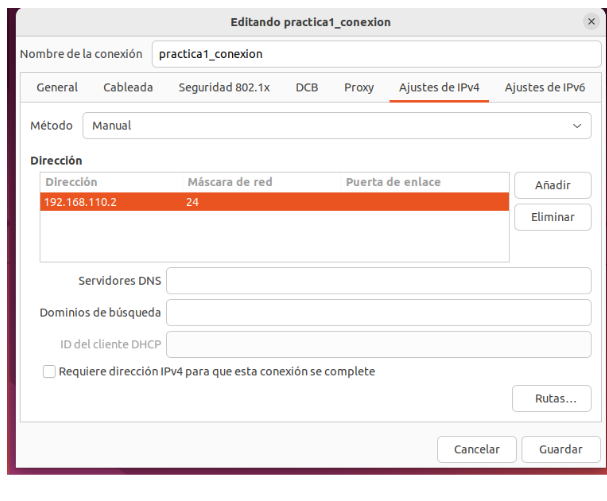
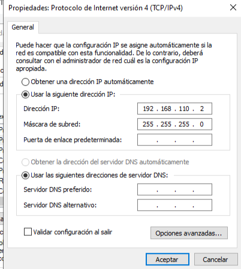
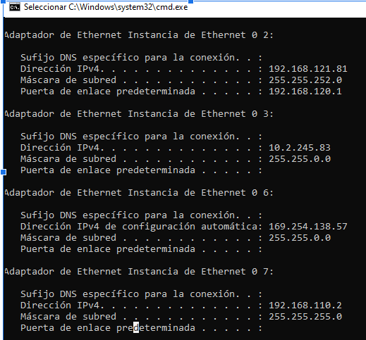
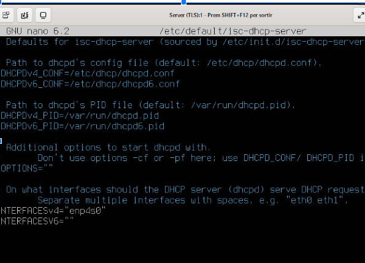
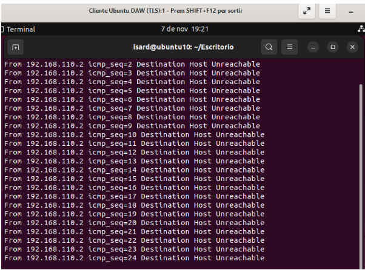

Claro, aquí tienes el esquema en formato Markdown:

```markdown
# Práctica 1: Interconexión de Equipos en Escritorios Virtuales

## Objetivos
1. Cambiar el nombre de las máquinas.
2. Configurar tarjetas de red.
3. Configurar servidor DHCP en Ubuntu Server.
4. Documentar la práctica usando Markdown y GitHub.

---

## 1. Cambiar Nombre de Máquina

### **Ubuntu Server**
1. Edita el archivo `/etc/hostname` usando un editor de texto:
   ```bash
   sudo nano /etc/hostname
   ```
2. Cambia el nombre a `serverXX` (donde XX es tu número de alumno).
3. Reinicia el equipo para que surta efecto:
   ```bash
   sudo reboot
   ```

### **Cliente Ubuntu**
1. Accede a la configuración de red y cambia el nombre del equipo a `ubuntuXX`.




### **Cliente Windows**
1. Accede a las propiedades del sistema (botón derecho sobre "Este PC") y cambia el nombre a `windowsXX`.


---

## 2. Configurar Tarjetas de Red en Ubuntu Server

### **Configuración de Red con Netplan**
1. Abre el archivo de configuración de Netplan:
   ```bash
   sudo nano /etc/netplan/00-installer-config.yaml
   ```
2. Configura las interfaces de red:
   - Tarjeta NAT: Usar DHCP (por defecto).
   - Tarjeta VPN: Configurar según sea necesario (si aplica).
   - Tarjeta `sanh3`: Asigna la IP estática `192.168.X.1/24`:
     ```yaml
     network:
       version: 2
       renderer: networkd
       ethernets:
         enp4s0:
           dhcp4: true
         enp5s0:
           dhcp4: true
         enp6s0:
           dhcp4: false
           addresses:
             - 192.168.X.1/24
     ```
3. Aplica los cambios:
   ```bash
   sudo netplan apply
   ```
4. Verifica la configuración de la IP:
   ```bash
   ip a
   ```

---

## 3. Configurar Cliente Ubuntu

### **Cambiar Nombre del Equipo**
1. Accede al diálogo de configuración y cambia el nombre del equipo a `ubuntuXX`.

### **Configurar Red Estática**
1. Accede a las conexiones de red y asigna la IP estática `192.168.X.2/24`.





### **Verificar IP**
   ```bash
   ip a
   ```

### **Probar Conexión con el Servidor**
   ```bash
   ping 192.168.X.1
   ```

---

## 4. Configurar Cliente Windows

### **Cambiar Nombre del Equipo**
1. Haz clic derecho en "Este PC" y selecciona "Propiedades" para cambiar el nombre a `windowsXX`.

### **Configurar Red Estática**
1. Accede a las conexiones de red (Windows + X → Conexiones de red) y asigna la IP estática `192.168.X.2/24`.




### **Verificar IP**
   ```bash
   ipconfig
   ```





### **Probar Conexión con el Servidor**
   ```bash
   ping 192.168.X.1
   ```

---

## 5. Configuración de Servidor DHCP en Ubuntu Server

### **Configurar el Servidor DHCP**
1. Añade una nueva tarjeta de red para la red `Personal 1` (enp4s0).
2. Configura el servidor DHCP en el archivo `/etc/dhcp/dhcpd.conf` con el rango de IPs `192.168.X.100 - 192.168.X.200`:
   ```bash
   subnet 192.168.X.0 netmask 255.255.255.0 {
     range 192.168.X.100 192.168.X.200;
    
   }
   ```





### **Reiniciar el Servicio DHCP**
   ```bash
   sudo systemctl restart isc-dhcp-server
   ```

### **Verificar el Estado del Servicio y el Puerto 67**
   ```bash
   sudo netstat -tulnp | grep :67
   ```


# HASTA AQUI LLEGAMOS NO SE COMO AVANZAR





### **Configurar los Clientes para Usar DHCP**
1. Asegúrate de que las tarjetas de red en los clientes estén configuradas para usar DHCP.

### vrificar la Dirección Obtenida y la Conexión**
1. En los clientes, ejecuta:
   - **Ubuntu Cliente:**
     ```bash
     ip a
     ```
   - **Windows Cliente:**
     ```bash
     ipconfig
     ```
2. Prueba la conexión entre los clientes y el servidor usando `ping`:
   - **Ubuntu Cliente:**
     ```bash
     ping 192.168.X.1
     ```
   - **Windows Cliente:**
     ```bash
     ping 192.168.X.1
     ```

---

