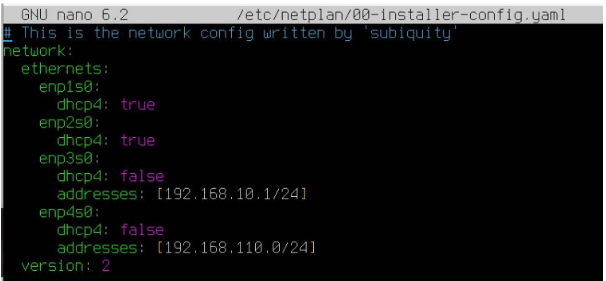

# Práctica 1: Servicios en Red
## Interconexión de Equipos en Escritorios Virtuales
**Josting Molina Hernández**  
**N.10**

---

## Objetivos
1. Cambio de nombres de máquina.
2. Configurar tarjetas de red.
3. Configurar servidor DHCP en Ubuntu Server.

---

## 1. Cambio de Nombres de Máquina

### Nuevos nombres asignados:
- Servidor: `server10`
- Cliente Ubuntu: `ubuntu10`
- Cliente Windows: `windows10`

### Pasos de Configuración

#### **Servidor**
Para cambiar el nombre del servidor, se modifica el archivo `/etc/hostname`:

```bash
sudo nano /etc/hostname
```

Luego, reemplaza el nombre actual por `server10`.


#### **Cliente Ubuntu**
1. Accede a la configuración de red y asigna el nombre del equipo como `ubuntu10`.


#### **Cliente Windows**
1. Accede a las propiedades del sistema (botón derecho sobre "Este PC") y cambia el nombre a `windows10`.


---

## 2. Configuración de Tarjetas de Red en Ubuntu Server

### Configuración de Red con Netplan

1. Abre el archivo de configuración de Netplan:
   ```bash
   sudo nano /etc/netplan/00-installer-config.yaml
   ```
   
2. Configura las interfaces de red:
   - Tarjeta NAT: Usar DHCP (por defecto).
   - Tarjeta VPN: Configurar según sea necesario (si aplica).
   - Tarjeta `sanh3`: Asigna la IP estática `192.168.10.1/24`.
   
3. Aplica los cambios:
   ```bash
   sudo netplan apply
   ```

4. Verifica la configuración de la IP:
   ```bash
   ip a
   ```


---

## 3. Configurar Cliente Ubuntu

### Cambiar Nombre del Equipo
1. Accede al diálogo de configuración y cambia el nombre del equipo a `ubuntu10`.

### Configurar Red Estática
1. Asigna la IP estática `192.168.10.2/24` en la configuración de red.


### Verificar IP y Probar Conexión con el Servidor
   ```bash
   ip a
   ```
   ```bash
   ping 192.168.10.1
   ```

---

## 4. Configurar Cliente Windows

### Cambiar Nombre del Equipo
1. Haz clic derecho en "Este PC" y selecciona "Propiedades" para cambiar el nombre a `windows10`.

> **Nota:** Aquí hubo un error inicial con la dirección IP `192.168.110.2/24` en lugar de `192.168.10.2/24`.

### Configurar Red Estática
1. Asigna la IP estática `192.168.10.2/24` en Conexiones de Red.


### Verificar IP y Probar Conexión con el Servidor
   ```bash
   ipconfig
   ```
   ```bash
   ping 192.168.10.1
   ```


---

## 5. Configuración del Servidor DHCP en Ubuntu Server

### Configurar el Servidor DHCP

1. Añade una nueva tarjeta de red para la red `Personal 1` (enp4s0). Configura la tarjeta de red adicional en el servidor siguiendo el procedimiento previo.



2. Ejecuta los siguientes comandos para aplicar la configuración de red y luego instala el servidor DHCP:
   ```bash
   sudo netplan apply
   sudo netplan generate
   ```
   ```bash
   sudo dpkg --configure -a  # Ejecutar en caso de error
   sudo apt-get install isc-dhcp-server
   ```

3. Configura la interfaz que utilizará el servidor DHCP en `/etc/default/isc-dhcp-server`.

### Configurar el Rango de Direcciones IP en el Servidor DHCP

1. Edita el archivo `/etc/dhcp/dhcpd.conf` y define el rango de IPs:
   ```bash
   subnet 192.168.10.0 netmask 255.255.255.0 {
     range 192.168.10.100 192.168.10.200;
   }
   ```


### Reiniciar y Verificar el Servicio DHCP
   ```bash
   sudo systemctl restart isc-dhcp-server
   ```
   
   ```bash
   sudo netstat -tulnp | grep :67
   ```


---

### Configurar Clientes para Usar DHCP

1. Configura las tarjetas de red de los clientes (tanto en Ubuntu como en Windows) para que usen DHCP.


### Verificar Dirección Obtenida y Conexión

1. En el cliente Ubuntu, verifica la IP y prueba la conexión:
   ```bash
   ip a
   ```
   ```bash
   ping 192.168.10.1
   ```

   

2. En el cliente Windows, ejecuta los comandos para verificar IP y probar conexión:
   ```bash
   ipconfig
   ```
   ```bash
   ping 192.168.10.1
   ```

   

---

## 6. Configuración de Reservas de IP en el Servidor DHCP

Para asignar IP fija a un cliente, verifica las direcciones actuales reservadas con el comando `dhcp-lease-list` y consulta el archivo de concesiones DHCP con:
   ```bash
   cat /var/lib/dhcp/dhcpd.leases
   ```

Luego, edita el archivo `/etc/dhcp/dhcpd.conf` para declarar la reserva de IP. Modifica el nombre de host en la declaración como desees.


Finalmente, reinicia el servicio para aplicar los cambios:
   ```bash
   sudo systemctl restart isc-dhcp-server
   ```