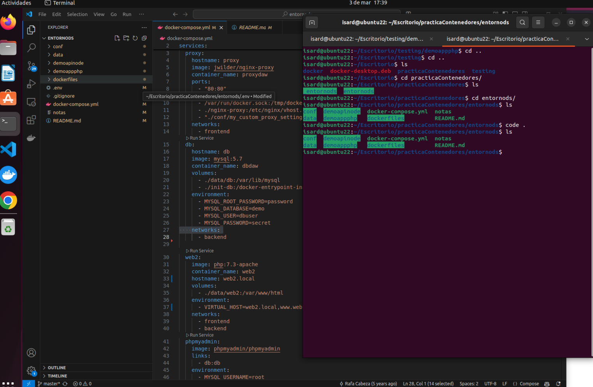
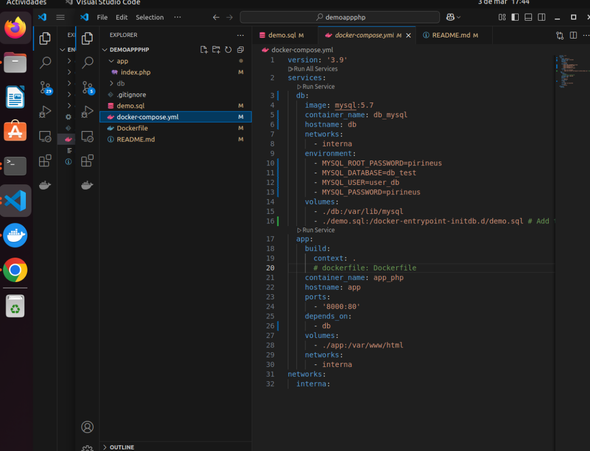
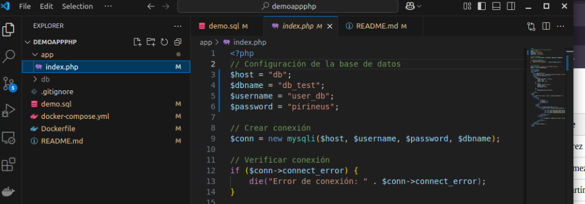
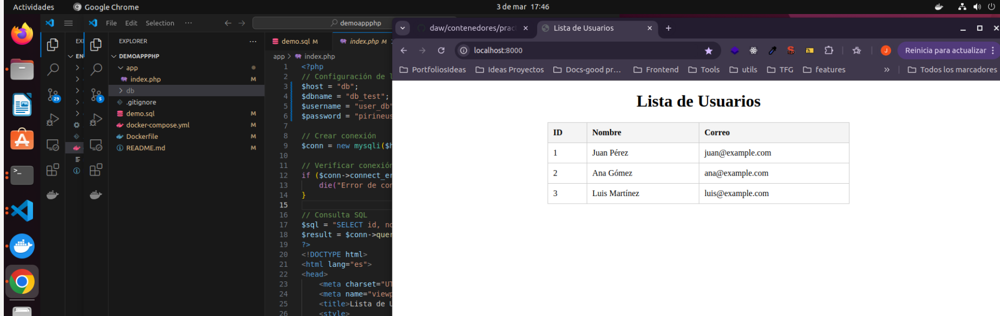

# Práctica de despliegue con Docker

## Punto de partida

- Usa la máquina: "Practicas Docker Ubuntu"
- Borra todos los contenedores e imágenes:

  ```bash
  docker rm -f $(docker ps -aq)
  docker rmi -f $(docker images -aq)
  ```

## Objetivo

- Debes desplegar las siguientes aplicaciones:
  - https://github.com/rafacabeza/demoapinode
  - https://github.com/rafacabeza/demoappphp
- Debes usar un contenedor con un proxy.
- Debes usar un contenedor por cada aplicación y dos contenedores de bases de datos.
- Opcionalmente puedes usar contenedores para phpmyadmin
- Las aplicaciones serán app1.local y app2.local.

## Desarrollo de la práctica

- Para hacerlo debes usar un único fichero docker-compose.yml teniendo en cuenta lo siguiente:
  - Inicia el proceso clonando el repositorio entornods(https://github.com/rafacabeza/entornods)
  - Elimina el servicio web1
  - Comprueba que funciona correnctamente el sitio web2.com (deberas editar el fichero hosts)
  - Deja una única red (network) en todos los contenedores. Llámale como consideres.




### Sitio app1.local

- Añade un servicio db1 (puedes renombrar el servicio db como db1)
  - El volumen de datos debe llamarse volumen1 y debe gestionarlo docker
  - Debes usar una base de datos llamda dbapp1 
  - Debes usar un usuario user1 y contraseña secret
  - Carga el sql correspondiente. Puedes hacerlo con phpmyadmin o mediante consola (docker exec -it <contenedor> mysql ....).
- Añade un servicio app1 para que sirva la aplicación "demoapinode". 
  - Descarga la aplicación en "entornods/demoapinode".
  - Fíjate en el docker-compose.yml que hay en el repositiro, te ayudará a definir el servicio en tu docker-compose pero deberás modificar algunas cosas.
  - Deberás añadir en variable de entorno "VIRTUAL_HOST", fíjate en web2
  - Revisa el resto de parámetros
- Comprueba que funciona la ruta: http://app1.local


# NO TENGO NI IDEA DE COMO HACERLO 

### Sitio app2.local - Levantar la aplicacion de php con mysql

- Añade un servicio db2 para la base de datos de "demoappphp"
  - El volumen de datos debe llamarse volumen2 y debe gestionarlo docker
  - Debes usar una base de datos llamda dbapp2 
  - Debes usar un usuario user2 y contraseña secret
  - Carga el sql correspondiente. De nuevo, puedes usar phpmyadmin o la consola.
- Añade un servicio app2 que sirva la aplicación "demoappphp"
  - Descarga la aplicación en "entornods/demoappphp".
  - Fíjate en el docker-compose.yml que ha en repositorio, te ayudará a definir el servicio en tu docker-compose pero deberás modificar algunas cosas.
  - Deberás añadir en variable de entorno "VIRTUAL_HOST", fíjate en web2
- Comprueba que funciona la ruta: http://app2.local/api/deseos


## 🛠️ **Paso 1: Preparar el proyecto**  
1. Clona el repositorio de la aplicación PHP:  
```bash
git clone https://github.com/rafacabeza/demoappphp.git
cd demoappphp
```

---

## 🐳 **Paso 2: Crear un `Dockerfile` para PHP y Apache**  
Crea un archivo llamado `Dockerfile` en el directorio raíz del proyecto con el siguiente contenido:  

```Dockerfile
# Usa una imagen oficial de PHP con Apache
FROM php:8.1-apache

# Instala extensiones necesarias para conectarse a MySQL
RUN docker-php-ext-install mysqli pdo pdo_mysql

# Copia el código de la aplicación al contenedor
COPY . /var/www/html

# Permisos para el directorio de la aplicación
RUN chown -R www-data:www-data /var/www/html

# Expone el puerto 80 del contenedor
EXPOSE 80
```


---

## 📦 **Paso 3: Configurar `docker-compose.yml`**  

### Ojo: Cambiar las credenciales conforme a lo que pongas aqui
    - app/index.php
    - demo.sql - USE db_test


    
Crea un archivo `docker-compose.yml` en la raíz del proyecto con la configuración para los contenedores PHP y MySQL:  

```yaml
version: '3.9'

services:
  php-apache:
    build: .
    container_name: php-apache-container
    ports:
      - "8000:80"
    volumes:
      - ./db:/var/lib/mysql
      - ./demo.sql:/docker-entrypoint-initdb.d/demo.sql 

    depends_on:
      - db

  db:
    image: mysql:8.0
    container_name: mysql-container
    environment:
      MYSQL_ROOT_PASSWORD: root
      MYSQL_DATABASE: demoapp
      MYSQL_USER: user
      MYSQL_PASSWORD: password
    ports:
      - "3306:3306"
    volumes:
      - db_data:/var/lib/mysql

volumes:
  db_data:
```




---

## 🚀 **Paso 4: Levantar los contenedores**  
En el terminal, en la raíz del proyecto, ejecuta:  

```bash
docker-compose up --build -d
```

Esto:  
- Construye la imagen de PHP+Apache.  
- Inicia los contenedores PHP y MySQL.  

---

## 🔍 **Paso 5: Comprobar si funciona**  
Abre tu navegador en `http://localhost:8000` para verificar que la aplicación PHP se ejecute correctamente.  





# HASTA AQUI LLEGAMOS
